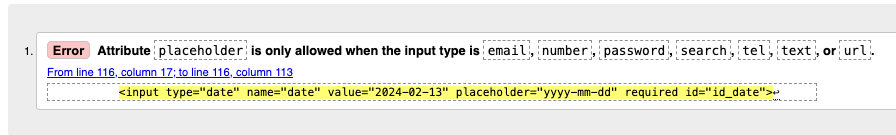
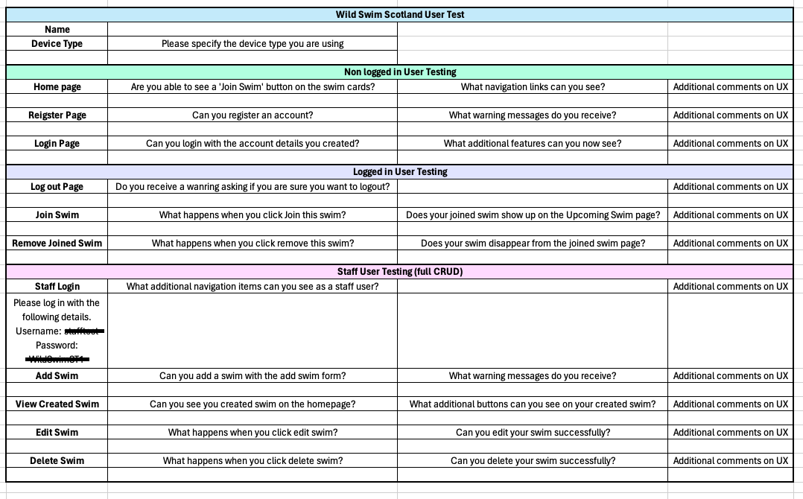
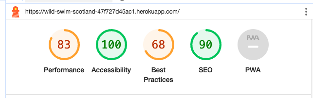
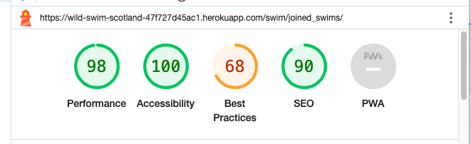
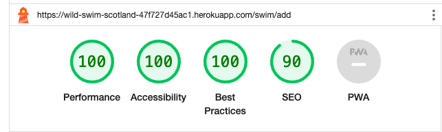
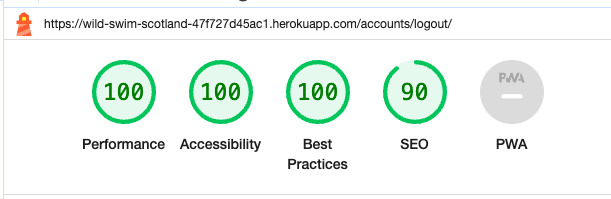
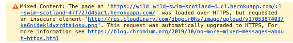

# Wild Swim Scotland Testing

Return to [README.md](README.md)

# Table of Contents

- [Code Validation](#code-validation)
    - [W3C HTML Validation Results](#w3c-html-validation-results)
    - [W3C CSS Validation Results](#w3c-css-validation-results)
    - [JSHint Validation Results](#jshint-validation-results)
    - [CI Python Linter Validation Results](#ci-python-linter-validation-results)
- [Manual Testing](#manaul-testing)
    - [Home Page](#home-page)
    - [Register Page](#register-page)
    - [Login Page](#login-page)
    - [Homepage as Logged in user](#homepage-as-logged-in-user)
    - [Upcoming Swims](#upcoming-swims)
    - [Logout](#logout)
    - [Homepage as staff user](#homepage-as-staff-user)
    - [Add Swim](#add-swim)
    - [Edit Swim](#edit-swim)
    - [Delete Swim](#delete-swim)
    - [Other Testing](#other-testing)
    - [Responsiveness testing](#responsivness-testing)
- [Browser Compatibility](#browser-compatibility)
- [User Testing](#user-testing)
- [Accessibility Testing](#accessibility-testing)
- [Known Bugs](#known-bugs)

# Code Validation 

## W3C HTML Validation Results

All HTML code has been run through the [W3C HTML Validator](https://validator.w3.org/).

 W3C HTML Errors Found and fixed

joined_swims.html

add_swim.html

edit_swim.html

signup.html

After testing all errors were fixed and document checking complete was shown for all pages

| **SOURCE CODE TEMPLATE** | **RUN THROUGH VALIDATOR** | **ANY ERRORS** | **ERRORS RESOLVED** |
| -------- | ---------- | --------------- | -----------|
| swim_posts.html | Yes | No | N/A |
| joined_swims.html | Yes | Yes - detailed image above | Yes, retested and all passed |
| edit_swims.html | Yes | Yes - detailed image above | No, moved to bug section |
| delete_swims.html | Yes | No | N/A |
| add_swim.html | Yes | Yes - detailed image above | No, moved to bug section |
| signup.html | Yes | Yes - detailed image above | Yes, retested and all passed |
| login.html | Yes | No | N/A |
| logout.html | Yes | No | N/A |

## W3C CSS Validation Results

All custom CSS has been run through the [W3C CSS Validator](https://jigsaw.w3.org/css-validator/ "jigsaw w3 page")

No errors were found when running CSS through w3c validator

## JSHint Validation Results

No javascript was used for this project.

## CI Python Linter Validation Results

All python code that was written for this project by Sarah Goodwin was developed following PEP8 guidelines and was run through the [CI Python Linter](https://pep8ci.herokuapp.com/ "ci python linter page")

| **Python file** | **RUN THROUGH VALIDATOR** | **ANY ERRORS** | **ERRORS RESOLVED** |
| -------- | ---------- | --------------- | -----------|
| views.py | Yes | Some trailing white spaces | All clear, re-run and no error found |
| urls.py | Yes | All clear, no errors found | N/A |
| modles.py | Yes | 1 trailing white space | All clear, re-run and no error found |
| forms.py | Yes | Line too long (89 > 79 characters) | Added   # noqa and all clear |
| admin.py | Yes | All clear, no errors found | N/A |
| settings.py | Yes | 1 trailing white space | All clear, re-run and no error found |

Final testing showed:

# Manual Testing

## Home Page

| **TEST** | **ACTION** | **EXPECTATION** | **RESULT** | **FIX** |
| -------- | ---------- | --------------- | -----------| ------- |
| Swim Cards | Opened site url | Swim cards are visible | Worked as expected | N/A |
| Nav Links | Opened site url | Only register and login nav links are visible | Worked as expected | N/A |
| Join Swim Buttons | Opened site url | Cannot see Join Swim Buttons | Worked as expected | N/A |

## Register Page

| **TEST** | **ACTION** | **EXPECTATION** | **RESULT** | **FIX** |
| -------- | ---------- | --------------- | -----------| ------- |
| Registration Form | Clicked on register nav link | Register form is displaying | Worked as expected | N/A |
| Username | Typed in @£$%^ as username | Warning will show | Warning showed 'Enter a valid username. This value may contain only letters, numbers, and @/./+/-/_ characters.' | Worked as expected |
| Username | Typed in admin as username | Warning will show | Warning showed 'A user with that username already exists.' | Worked as expected |
| Password 1 | Typed in password same as username | Warning will show | Warning showed 'The password is too similar to the username.' | Worked as expected |
| Password 2 | Typed in password different to password1 | Warning will show | Warning showed 'You must type the same password each time.' | Worked as expected |
| Register Button | Click Register | Button takes user to logged in dashboard on homepage | Worked as expected | N/A |
| Login Button | Clicked on login link | Get taken to login page | Worked as expected | N/A |

## Login Page

| **TEST** | **ACTION** | **EXPECTATION** | **RESULT** | **FIX** |
| -------- | ---------- | --------------- | -----------| ------- |
| Username | Typed in random username | Warning will show | Warned showed 'The username and/or password you specified are not correct.' | Worked as expected |
| Password | Typed in incorrect password | Warning will show | Warned showed 'The username and/or password you specified are not correct.' | Worked as expected |
| Sign In | Typed in correct username and password, pressed sign up | Button takes user to logged in dashboard on homepage | Worked as expected | N/A |
| Sign Up | Clicked on Sign Up link | Get taken to register page | Worked as expected | N/A |

## Homepage as Logged in user

| **TEST** | **ACTION** | **EXPECTATION** | **RESULT** | **FIX** |
| -------- | ---------- | --------------- | -----------| ------- |
| Join Swim Button | Clicked Join Swim | Swim added to upcoming swims page | Worked as expected | N/A |
| Your Upcoming Swims | Left page and re-clicked on upcoming swims | Previous swims that had been added still there | Worked as expected | N/A |
| Logout | Logout button replaced login button | No login button | Worked as expected | N/A |
| Register | Register button no longer available | No register button | Worked as expected | N/A |

## Upcoming Swims

| **TEST** | **ACTION** | **EXPECTATION** | **RESULT** | **FIX** |
| -------- | ---------- | --------------- | -----------| ------- |
| No Swims Joined | Click on upcoming swims without joining a swim | Message 'No swims joined yet' will show | Worked as expected | N/A |
| Joined Swim | Click on join swim button | Swim will be put onto upcoming swim page and redirected | New message showed saying 'Thank you for joining us, we can't wait to see you there!' | Worked as expected |
| Remove Swim | Click remove swim button | Swim will disappear | Swim removed and stayed on upcoming swim page | Worked as expected |

## Logout

| **TEST** | **ACTION** | **EXPECTATION** | **RESULT** | **FIX** |
| -------- | ---------- | --------------- | -----------| ------- |
| Logout | Clicked logout from nav bar | Message asking 'Are you sure you want to sign out?' | Worked as expected | N/A |
| Sign Out button | Clicked sign out | Redirected to homepage as non logged in user | Worked as expected | N/A |

## Homepage as staff user

| **TEST** | **ACTION** | **EXPECTATION** | **RESULT** | **FIX** |
| -------- | ---------- | --------------- | -----------| ------- |
| Can see edit and delete buttons | As staff user I can see the edit and delete buttons for only swims I created | Edit and delete buttons appear | Worked as expected | N/A |

## Add Swim

| **TEST** | **ACTION** | **EXPECTATION** | **RESULT** | **FIX** |
| -------- | ---------- | --------------- | -----------| ------- |
| Add Swim | Clicked Add Swim nav link | Add swim form showed | Worked as expected | N/A |
| Title | Tried to type unending title  | Form stops user from typing further | Worked as expected | N/A |
| Description | Tired to type more than 250 characters | Form stops typing further | Worked as expected | N/A |
| Date | Tried to input wrong date format | Date Picker stops form with error message | Worked as expected | N/A |
| Date | Tried to type 45 in day section | Date Picker automatically moves user forward | Worked as expected | N/A |
| Time | Tried to input 19.20 as time | Error message show | Error message showed 'Enter a valid time.' | Worked as expected |
| Swim Difficulty | Tried to put 10 as swim level | Error message to show | Error message showed 'Ensure this value is less than or equal to 5.' | Worked as expected |
| Location | Tried to type unending location | Form stops user from typing further | Worked as expected | N/A |
| With image | Submitted large image | Image to be resized to fit swim card | Worked as expected | N/A |
| No image | Submitted no image | Image to be replaced with placeholder | Worked as expected | N/A |
| Submit | Clicked submit button | Form to be submitted and new swim card created | Worked as expected | N/A |
| New swim added to homepage | Can see swim on homepage | Showing edit and delete buttons for new swim | Worked as expected | N/A |

## Edit Swim

| **TEST** | **ACTION** | **EXPECTATION** | **RESULT** | **FIX** |
| -------- | ---------- | --------------- | -----------| ------- |
| Data prefilled | Clicked Edit Swim | Data from swim is prefilled | Worked as expected | N/A |
| Title | Tried to type unending title  | Form stops user from typing further | Worked as expected | N/A |
| Description | Tired to type more than 250 characters | Form stops typing further | Worked as expected | N/A |
| Date | Tried to input wrong date format | Date Picker stops form with error message | Worked as expected | N/A |
| Date | Tried to type 45 in day section | Date Picker automatically moves user forward | Worked as expected | N/A |
| Time | Tried to input 19.20 as time | Error message show | Error message showed 'Enter a valid time.' | Worked as expected |
| Swim Difficulty | Tried to put 10 as swim level | Error message to show | Error message showed 'Ensure this value is less than or equal to 5.' | Worked as expected |
| Location | Tried to type unending location | Form stops user from typing further | Worked as expected | N/A |
| With image | Submitted large image | Image to be resized to fit swim card | Worked as expected | N/A |
| No image | Submitted no image | Image to be replaced with placeholder | Worked as expected | N/A |
| Submit | Clicked submit | New edits show on homepage | Worked as expected | N/A |
| New swim added to homepage | Clicked Home | New edits show on homepage | Worked as expected | N/A |

## Delete Swim

| **TEST** | **ACTION** | **EXPECTATION** | **RESULT** | **FIX** |
| -------- | ---------- | --------------- | -----------| ------- |
| Delete Swim | Clicked Delete Swim button on swim card | Message shows asking if swim should be deleted | Worked as expected | N/A |
| Delete Swim on delete page | Clicked delete | Swim is removed from homepage and user redirected back home | Worked as expected | N/A |

## Other Testing

| **TEST** | **ACTION** | **EXPECTATION** | **RESULT** | **FIX** |
| -------- | ---------- | --------------- | -----------| ------- |
| 404 Error | Typed /hello at end of url | 404 error page to show | Worked as expected | N/A |
| URL Access | Typed /swim/add at end of url | 404 error page to show | Taken back to login page | Warning could be added to show to user what happened rather than redirect |
| URL Access | Typed /article/add at end of url | 404 error page to show | Taken back to login page | Warning could be added to show to user what happened rather than redirect |

## Responsiveness testing

| **DEVICE** | **ACTION** | **EXPECTATION** | **RESULT** | **FIX** |
| -------- | ---------- | --------------- | -----------| ------- |
| Samsung22 Ultra | Tested site on mobile | Site functions and is responsive | Worked as expected | N/A |
| iPhone 15 | Tested site on mobile | Site functions and is responsive | Worked as expected | N/A |
| Dev Tools for iPad | Tested site for iPad Pro via dev tools | Site functions and is responsive | Worked as expected | N/A |

## Browser Compatibility

The site was tested on the following browser types

* Google Chrome
* Microsoft Edge
* Safari

## User Testing

A user testing form was sent to friends and family to test the site on their devices and get real world feedback from people who had not been involved in the creation of the site.

Here is the form that was sent.

Feedback from the form

* Better responsiveness for mobile - added media queries after this feedback
* User testing did not throw many errors as users followed instructions
* Users found it easy to add, edit, and delete a swim
* Users found it easy to create an account and navigate the website 

### Things to implement from user testing

* User reported that "I put in a non matching password and it didn't warn me" so password errors were added to form to ensure this cannot happen

* User reported "Had a problem with the time field. Would be good to know the format it was looking for." so placeholder text was added

* User reported "It would be good if errors popped up in a different colour. I entered something incorrectly when creating an account and it took me a second to notice because it was the same colour font" - this would be a good feature for future implementation 

# Accessibility Testing

## Lighthouse

Google Lighthouse test from the dev tools was used to test the pages on the site for 

* Performance
* Accessibility
* Best Practices
* SEO

Examples of results are as follows:

 Home 

 Upcoming Swims 

 Add Swim 

 Logout 

# Known Bugs

## Resolved

Error in the console was showing a Mixed Content Error

This error was typed into Google and the [Stack Overflow](https://stackoverflow.com/questions/67765238/mixed-content-the-page-at-was-loaded-over-https-but-requested-an-insecure-resour "stack overflow mixed content error") question for the error gave the answer.

The meta tag <meta http-equiv="Content-Security-Policy" content="upgrade-insecure-requests"> was added to the base.html and the error was resolved.

## Unresolved 

No known unresolved bugs

Return to [README.md](README.md)

