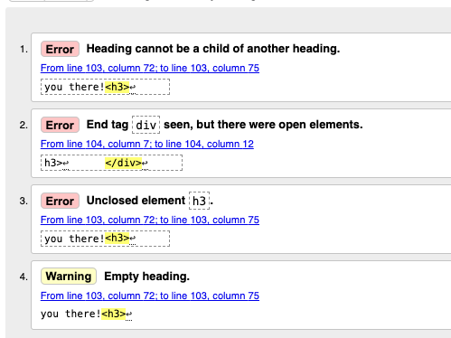
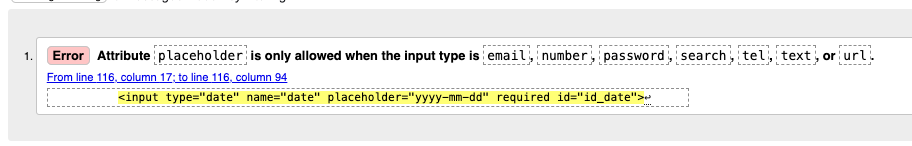
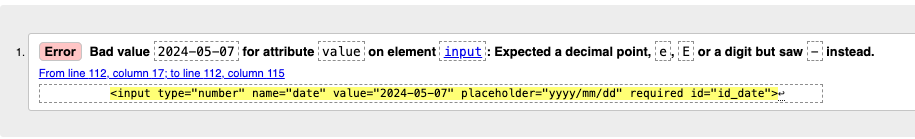
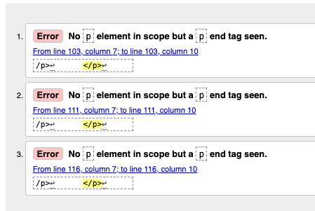
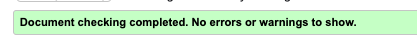
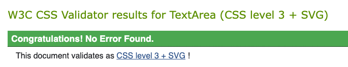

# Wild Swim Scotland Testing

Return to [README.md](README.md)

# Code Validation 

## W3C HTML Validation Results

All HTML code has been run through the [W3C HTML Validator](https://validator.w3.org/).

 W3C HTML Errors Found and fixed

joined_swims.html

add_swim.html

edit_swim.html

signup.html

After testing all errors were fixed and document checking complete was shown for all pages

| **SOURCE CODE TEMPLATE** | **RUN THROUGH VALIDATOR** | **ANY ERRORS** | **ERRORS RESOLVED** |
| -------- | ---------- | --------------- | -----------|
| swim_posts.html | Yes | No | N/A |
| joined_swims.html | Yes | Yes - detailed image above | Yes, retested and all passed |
| edit_swims.html | Yes | Yes - detailed image above | No, moved to bug section |
| delete_swims.html | Yes | No | N/A |
| add_swim.html | Yes | Yes - detailed image above | No, moved to bug section |
| signup.html | Yes | Yes - detailed image above | Yes, retested and all passed |
| login.html | Yes | No | N/A |
| logout.html | Yes | No | N/A |

## W3C CSS Validation Results

All custom CSS has been run through the [W3C CSS Validator](https://jigsaw.w3.org/css-validator/ "jigsaw w3 page")

No errors were found when running css through w3c validator

## JSHint Validation Results

No javascript was used for this project.

## CI Python Linter Validation Results

All python code that was written for this project by Sarah Goodwin was developed following PEP8 guidelines and was run through the [CI Python Linter](https://pep8ci.herokuapp.com/ "ci python linter page")

| **Python file** | **RUN THROUGH VALIDATOR** | **ANY ERRORS** | **ERRORS RESOLVED** |
| -------- | ---------- | --------------- | -----------|
| views.py | Yes | Some trailing white spaces | All clear, re-run and no error found |
| urls.py | Yes | All clear, no errors found | N/A |
| modles.py | Yes | 1 trailing white space | All clear, re-run and no error found |
| forms.py | Yes | Line too long (89 > 79 characters) | Added   # noqa and all clear |
| admin.py | Yes | All clear, no errors found | N/A |
| settings.py | Yes | 1 trailing white space | All clear, re-run and no error found |

Final testing showed:

# Manaul Testing

## Home Page

| **TEST** | **ACTION** | **EXPECTATION** | **RESULT** | **FIX** |
| -------- | ---------- | --------------- | -----------| ------- |
| Swim Cards | Opened site url | Swim cards are visable | Worked as expected | N/A |
| Nav Links | Opened site url | Only register and login nav links are visable | Worked as expected | N/A |
| Join Swim Buttons | Opened site url | Cannot see Join Swim Buttons | Worked as expected | N/A |

## Register Page

| **TEST** | **ACTION** | **EXPECTATION** | **RESULT** | **FIX** |
| -------- | ---------- | --------------- | -----------| ------- |
| Registration Form | Clicked on reigster nav link | Register form is displaying | -----------| ------- |
| Username | Typed in @£$%^ as username | Warning will show | Warning showed 'Enter a valid username. This value may contain only letters, numbers, and @/./+/-/_ characters.' | Worked as expected |
| Password 1 | Typed in password same as username | Warning will show | Warning showed 'The password is too similar to the username.' | Worked as expected |
| Password 2 | ---------- | --------------- | -----------| ------- |
| Register Button | ---------- | --------------- | -----------| ------- |
| Login Button | ---------- | --------------- | -----------| ------- |

## Login Page

| **TEST** | **ACTION** | **EXPECTATION** | **RESULT** | **FIX** |
| -------- | ---------- | --------------- | -----------| ------- |
| -------- | ---------- | --------------- | -----------| ------- |
| -------- | ---------- | --------------- | -----------| ------- |
| -------- | ---------- | --------------- | -----------| ------- |

## Homepage as Logged in user

| **TEST** | **ACTION** | **EXPECTATION** | **RESULT** | **FIX** |
| -------- | ---------- | --------------- | -----------| ------- |
| -------- | ---------- | --------------- | -----------| ------- |
| -------- | ---------- | --------------- | -----------| ------- |
| -------- | ---------- | --------------- | -----------| ------- |

## Upcoming Swims

| **TEST** | **ACTION** | **EXPECTATION** | **RESULT** | **FIX** |
| -------- | ---------- | --------------- | -----------| ------- |
| -------- | ---------- | --------------- | -----------| ------- |
| -------- | ---------- | --------------- | -----------| ------- |
| -------- | ---------- | --------------- | -----------| ------- |

## Logout

| **TEST** | **ACTION** | **EXPECTATION** | **RESULT** | **FIX** |
| -------- | ---------- | --------------- | -----------| ------- |
| -------- | ---------- | --------------- | -----------| ------- |
| -------- | ---------- | --------------- | -----------| ------- |
| -------- | ---------- | --------------- | -----------| ------- |

## Homepage as staff user

| **TEST** | **ACTION** | **EXPECTATION** | **RESULT** | **FIX** |
| -------- | ---------- | --------------- | -----------| ------- |
| -------- | ---------- | --------------- | -----------| ------- |
| -------- | ---------- | --------------- | -----------| ------- |
| -------- | ---------- | --------------- | -----------| ------- |

## Add Swim

| **TEST** | **ACTION** | **EXPECTATION** | **RESULT** | **FIX** |
| -------- | ---------- | --------------- | -----------| ------- |
| -------- | ---------- | --------------- | -----------| ------- |
| -------- | ---------- | --------------- | -----------| ------- |
| -------- | ---------- | --------------- | -----------| ------- |

## Edit Swim

| **TEST** | **ACTION** | **EXPECTATION** | **RESULT** | **FIX** |
| -------- | ---------- | --------------- | -----------| ------- |
| -------- | ---------- | --------------- | -----------| ------- |
| -------- | ---------- | --------------- | -----------| ------- |
| -------- | ---------- | --------------- | -----------| ------- |

## Delete Swim

| **TEST** | **ACTION** | **EXPECTATION** | **RESULT** | **FIX** |
| -------- | ---------- | --------------- | -----------| ------- |
| -------- | ---------- | --------------- | -----------| ------- |
| -------- | ---------- | --------------- | -----------| ------- |
| -------- | ---------- | --------------- | -----------| ------- |

## Other Testing

| **TEST** | **ACTION** | **EXPECTATION** | **RESULT** | **FIX** |
| 404 Error | ---------- | --------------- | -----------| ------- |
| URL Access | ---------- | --------------- | -----------| ------- |
| -------- | ---------- | --------------- | -----------| ------- |
| -------- | ---------- | --------------- | -----------| ------- |

## Responsivness testing

| **DEVICE** | **ACTION** | **EXPECTATION** | **RESULT** | **FIX** |
| Samsung22 Ultra | ---------- | --------------- | -----------| ------- |
| iPhone 15 | ---------- | --------------- | -----------| ------- |
| Dev Tools for iPad | ---------- | --------------- | -----------| ------- |

## Browser Compatibility

The site was tested on the following browser types

* Google Chrome
* Microsoft Edge
* Safari

## User Testing

A user testing form was sent to friends and family to test the site on their devices and get real world feedback from people who had not been involved in the creation of the site.

Here is the form that was sent.

Feedback from the form

* Better responsivness for mobile - added media queries
* User testing did not throw any errors as users followed instructions
* Site was easy to use and user friendly 

# Automated Testing

# Accessibility Testing

## Lighthouse

# Known Bugs

## Resolved

- HTML

- Python

- Other

- Unresolved 

Return to [README.md](README.md)

